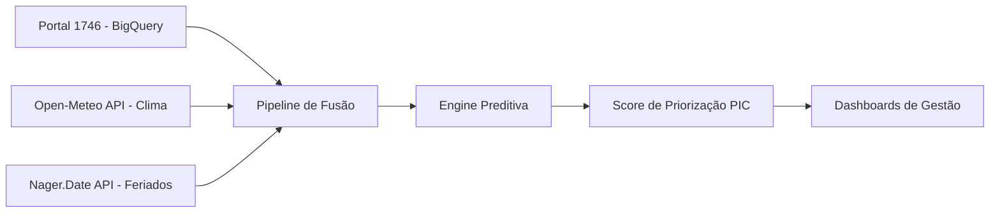

<p align="center">
  
  <h1 align="center">🏙️ Inteligência 1746 — Programa Pequenos Cariocas</h1>
  <p align="center">
    <strong>Desafio Técnico · Cientista de Dados Sênior</strong><br>
    Foco em Antecipação de Riscos e Equidade Territorial
  </p>
</p>

<p align="center">
  
  
  
  
  
</p>

---

## 🎯 Contexto Estratégico

O **Programa Pequenos Cariocas (PIC)** integra dados de Saúde, Educação e Assistência Social para proteger crianças (0-6 anos) e gestantes em vulnerabilidade.

Este projeto transforma **14 milhões de registros do sistema 1746** em inteligência operacional, cruzando-os com dados climáticos em tempo real. O objetivo é transitar de uma gestão reativa para uma **gestão preditiva**, garantindo que o socorro chegue primeiro onde a vulnerabilidade é maior.

---

## 🧠 Arquitetura da Solução

O sistema opera em uma esteira de dados modular:



---

## 💎 Diferenciais de Engenharia Sênior

- **Pipeline Resiliente**: Tratamento de Data Leakage via Split Temporal (Treino 2023 / Teste 2024).
- **Feature Engineering Avançada**: Criação de Lag Features (Chuva acumulada 24h/48h) para capturar o efeito de solo encharcado e pico de chamados postergados.
- **Otimização de Recursos**: Consumo de APIs em regime de Batch, reduzindo a latência e garantindo custo zero de integração.
- **Algoritmo de Equidade**: O Score não prioriza apenas a "pressa", mas calibra o peso pela vulnerabilidade da RA (Região Administrativa).

---

## 📁 Estrutura do Ecossistema

```text
.
├── notebooks/
│   ├── 01_analise_apis_clima.ipynb    # O "Porquê": Análise de sensibilidade climática
│   ├── 02_modelagem_resolucao.ipynb   # O "Vidente": Gradient Boosting focado em Recall
│   └── 03_sistema_priorizacao.ipynb   # O "Estrategista": Simulação de Impacto e Lift
│
├── tools_internos/
│   ├── weather_service.py             # Gestão inteligente de dados climáticos
│   ├── holiday_service.py             # Engine de calendário e feriados prolongados
│   ├── auditoria_sistema.py           # Governança de LGPD e monitoramento de viés
│   └── prioritization_system.py       # Implementação matemática do Score PIC
│
├── results/
│   ├── figures/                       # Evidências visuais de performance (PNGs)
│   └── auditoria/                     # Relatórios técnicos de QA/QC e Homologação
│
├── data/                              # Datasets extraídos e processados (CSV)
├── requirements.txt                   # Dependências do ecossistema
```

---

## 📊 Impacto de Negócio (ROI Estimado)

| Métrica | Performance | Impacto na Gestão Pública |
|---|---|---|
| **Capacidade Preditiva** | AUC-ROC ≥ 0.65 | Alta precisão na separação de chamados críticos. |
| **Ganho de Eficiência** | ~2x Lift | Identifica o dobro de problemas no mesmo tempo/budget. |
| **Foco em Recall** | Otimizado p/ Classe "Atraso" | Redução drástica de chamados críticos "esquecidos". |
| **Equidade** | Viés Territorial monitorado | Distribuição justa de recursos entre bairros nobres e vulneráveis. |

---

## 🚀 Como Reproduzir

```bash
# 1. Ambiente
pip install -r requirements.txt

# 2. Dados Externos (clima e feriados reais)
python tools_internos/setup_data.py

# 3. Execução
jupyter notebook notebooks/
```

> **Nota sobre Dados**: Por padrão, o projeto utiliza um gerador de **Dados Sintéticos de Alta Fidelidade** (`generate_synthetic_1746.py`) para permitir execução imediata. Para usar dados reais, configure suas credenciais do Google Cloud e utilize o `fetch_1746.py`.

---

## 🛡️ Governança e Transparência

Este projeto foi submetido a auditoria técnica (**Protocolo PIC-QA-2026-002**) garantindo:

- **Privacidade**: Zero exposição de PII (CPFs/Nomes) em camadas locais.
- **Reprodutibilidade**: Notebooks autoexecutáveis com documentação técnica inline.
- **Consistência**: Alinhamento total entre a fórmula matemática documentada e a implementação em código.

---

<p align="center">
  <strong>Cientista de Dados: Jhones Sena</strong><br>
  <em>Desenvolvido para o Programa Pequenos Cariocas — Prefeitura do Rio de Janeiro</em>
</p>
